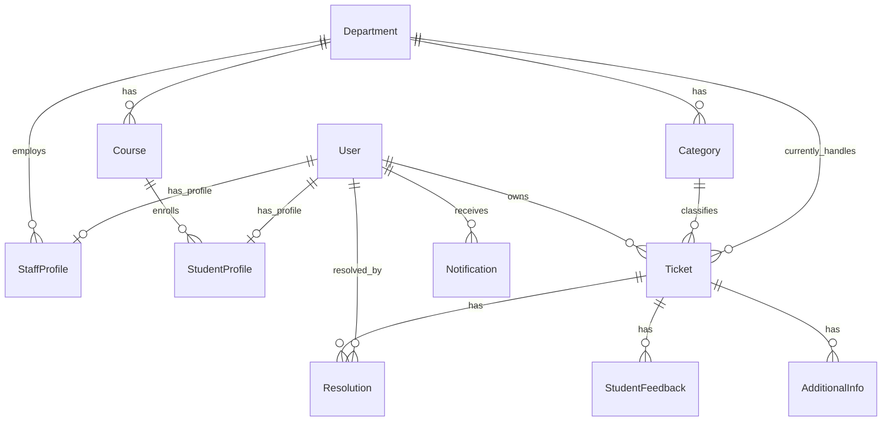

# UniResolve — System State Snapshot

> **Generated**: 2026-04-16  
> **Purpose**: Self-contained reference for comparing the coded system against the original technical documentation. Every section below is derived from actual source code, not specifications.

---

## Table of Contents

1. [Database Architecture (The Reality)](#1-database-architecture-the-reality)
2. [Core Business Logic & Workflows](#2-core-business-logic--workflows)
3. [Role-Based Access Control (RBAC)](#3-role-based-access-control-rbac)
4. [Feature Inventory](#4-feature-inventory)
5. [API & Frontend Integration Map](#5-api--frontend-integration-map)

---

## 1. Database Architecture (The Reality)

The system is split across **three Django apps** that define models: `accounts`, `tickets`, and `organization`. A fourth app, `common`, exists but contains no models.

### 1.1 `organization` App — Structural Backbone

```python
# organization/models.py

class Department(models.Model):
    department_name = models.CharField(max_length=100)

class Category(models.Model):
    category_name = models.CharField(max_length=100)
    department = models.ForeignKey(Department, on_delete=models.SET_NULL,
                                   null=True, blank=True, related_name='categories')
    is_academic = models.BooleanField(
        default=False,
        help_text="If True, issues in this category are routed to the student's home department first."
    )
    resolution_timeframe = models.PositiveIntegerField(
        default=48,
        help_text="Expected timeframe (in hours) to resolve issues in this category."
    )

class Course(models.Model):
    course_name = models.CharField(max_length=100)
    department = models.ForeignKey(Department, on_delete=models.CASCADE, related_name='courses')
```

### 1.2 `accounts` App — Users, Profiles & Notifications

```python
# accounts/models.py

class UserManager(BaseUserManager):
    def create_user(self, email, password=None, **extra_fields):
        if not email:
            raise ValueError("The Email field must be set")
        email = self.normalize_email(email)
        user = self.model(email=email, **extra_fields)
        user.set_password(password)
        user.save(using=self._db)
        return user

    def create_superuser(self, email, password=None, **extra_fields):
        extra_fields.setdefault('is_staff', True)
        extra_fields.setdefault('is_superuser', True)
        return self.create_user(email, password, **extra_fields)

class User(AbstractUser):
    roles_choices = [
        ('Student', 'Student'),
        ('Staff', 'Staff'),
        ('Admin', 'Admin'),
    ]
    role = models.CharField(max_length=20, choices=roles_choices, default='Student')
    email = models.EmailField(unique=True)
    first_name = models.CharField(max_length=100, blank=False)
    last_name = models.CharField(max_length=100, blank=False)
    must_change_password = models.BooleanField(default=False)
    username = models.CharField(max_length=100, unique=True, null=True, blank=True)
    USERNAME_FIELD = 'email'
    REQUIRED_FIELDS = ['first_name', 'last_name']
    objects = UserManager()

class StudentProfile(models.Model):
    user = models.OneToOneField(User, on_delete=models.CASCADE, related_name='student_profile')
    reg_number = models.CharField(max_length=20, unique=True)
    course = models.ForeignKey(
        'organization.Course', on_delete=models.PROTECT,
        related_name='students', null=True, blank=True
    )

class StaffProfile(models.Model):
    staff_roles_choices = [
        ('SENIOR', 'Senior'),
        ('STAFF', 'Staff'),
    ]
    user = models.OneToOneField(User, on_delete=models.CASCADE, related_name='staff_profile')
    employee_id = models.CharField(max_length=20, unique=True)
    staff_role = models.CharField(max_length=20, choices=staff_roles_choices, default='STAFF')
    department = models.ForeignKey(
        'organization.Department', on_delete=models.PROTECT,
        related_name='staff_members',
    )

class Notification(models.Model):
    user = models.ForeignKey(User, on_delete=models.CASCADE, related_name='notifications')
    message = models.CharField(max_length=255)
    link = models.CharField(max_length=255, blank=True, null=True,
                            help_text="URL to redirect to when clicked")
    is_read = models.BooleanField(default=False)
    created_at = models.DateTimeField(auto_now_add=True)

    class Meta:
        ordering = ['-created_at']
```

### 1.3 `tickets` App — Tickets, Resolutions, Feedback & Additional Info

```python
# tickets/models.py

class Ticket(models.Model):
    status_choices = [
        ('OPEN', 'open'),
        ('PENDING', 'pending'),
        ('RESOLVED', 'resolved'),
        ('ESCALATED', 'escalated'),
        ('TRANSFERRED', 'transferred'),
        ('CLOSED', 'closed'),
        ('REOPENED', 'reopened'),
        ('IN_PROGRESS', 'in progress'),
        ('REJECTED', 'rejected')
    ]
    title = models.CharField(max_length=200)
    description = models.TextField()
    attachment = models.FileField(upload_to='ticket_attachments/', null=True, blank=True)
    status = models.CharField(max_length=20, choices=status_choices, default='OPEN')
    is_escalated = models.BooleanField(default=False)
    is_deadline_warning_sent = models.BooleanField(default=False)
    owner = models.ForeignKey(settings.AUTH_USER_MODEL, on_delete=models.CASCADE,
                              related_name='tickets')
    category = models.ForeignKey('organization.Category', on_delete=models.PROTECT,
                                 related_name='tickets')
    current_department = models.ForeignKey(
        'organization.Department', on_delete=models.SET_NULL,
        null=True, blank=True, related_name='active_tickets',
        help_text="The department currently responsible for reviewing this ticket."
    )
    due_date = models.DateTimeField(null=True, blank=True)
    created_at = models.DateTimeField(auto_now_add=True)
    updated_at = models.DateTimeField(auto_now=True)
    pending_since = models.DateTimeField(null=True, blank=True)

    # --- Custom save() with SLA logic (see Section 2.2) ---

class Resolution(models.Model):
    status = models.CharField(max_length=20, choices=Ticket.status_choices, default='RESOLVED')
    feedback = models.TextField()
    ticket = models.ForeignKey(Ticket, on_delete=models.PROTECT, related_name='resolutions')
    resolved_by = models.ForeignKey(settings.AUTH_USER_MODEL, on_delete=models.SET_NULL,
                                    null=True, related_name="resolutions_provided")
    resolved_at = models.DateTimeField(auto_now_add=True)

class StudentFeedback(models.Model):
    ticket = models.ForeignKey(Ticket, on_delete=models.PROTECT,
                               related_name='student_feedbacks')
    student = models.ForeignKey(settings.AUTH_USER_MODEL, on_delete=models.SET_NULL,
                                related_name='feedbacks', null=True)
    is_satisfied = models.BooleanField(help_text="True if Yes/Closed, False if No/Reopened")
    comments = models.TextField(blank=True, null=True)
    created_at = models.DateTimeField(auto_now_add=True)

class AdditionalInfo(models.Model):
    ticket = models.ForeignKey(Ticket, on_delete=models.PROTECT,
                               related_name='additional_info')
    added_by = models.ForeignKey(settings.AUTH_USER_MODEL, on_delete=models.SET_NULL,
                                 null=True, related_name='additional_info_added')
    info = models.TextField()
    created_at = models.DateTimeField(auto_now_add=True)
    attachment = models.FileField(upload_to='additional_info_attachments/',
                                  null=True, blank=True)
```

### 1.4 Entity Relationships Explained



| Relationship | How it works |
|---|---|
| **Student → Department** | **Indirect**. `StudentProfile.course` → `Course.department`. A student's "home department" is accessed via `user.student_profile.course.department`. |
| **Staff → Department** | **Direct**. `StaffProfile.department` → `Department`. |
| **Category → Department** | **Direct FK**. Each category belongs to a department. However, if `Category.is_academic == True`, the ticket gets routed to the *student's* home department instead. |
| **Ticket → Department** | **Direct FK** via `current_department`. This is the *live* routing field—it changes on transfers and is set dynamically on creation. |
| **Ticket → Category** | **Direct FK**. Determines SLA timeframe and initial routing. |
| **Resolution → Ticket** | **Many-to-One**. A ticket can have multiple resolutions (audit trail). `on_delete=PROTECT` prevents ticket deletion if resolutions exist. |
| **Notification → User** | **Many-to-One**. Each notification belongs to one user. |

> [!IMPORTANT]
> The `Resolution` model is used as both an actual resolution record AND a timeline/audit log. System-generated events (transfers, escalations, additional info submissions) are logged as `Resolution` entries with `resolved_by=None`.

---

## 2. Core Business Logic & Workflows

### 2.1 Ticket Statuses

The system defines **9 statuses**:

| Status | DB Value | Trigger |
|---|---|---|
| **OPEN** | `'OPEN'` | Default on ticket creation. |
| **IN_PROGRESS** | `'IN_PROGRESS'` | Staff sets status via `ResolutionViewSet.perform_create()` with `status='IN_PROGRESS'`, **OR** student submits additional info (auto-set). |
| **PENDING** | `'PENDING'` | Staff sets status via `ResolutionViewSet.perform_create()` with `status='PENDING'`. Means "awaiting student's additional information". **Pauses the SLA clock.** |
| **RESOLVED** | `'RESOLVED'` | Staff sets status via `ResolutionViewSet.perform_create()` with `status='RESOLVED'`. Awaits student feedback. |
| **CLOSED** | `'CLOSED'` | Student submits satisfied feedback (`is_satisfied=True`) via `TicketViewSet.submit_feedback()`. Terminal state. |
| **REOPENED** | `'REOPENED'` | Student submits unsatisfied feedback (`is_satisfied=False`) via `TicketViewSet.submit_feedback()`. **Resets the SLA clock.** |
| **ESCALATED** | `'ESCALATED'` | **Manual**: Regular staff calls `escalate_ticket()` without a `target_department_id`. **Automatic**: `auto_escalate_overdue_tickets()` when `due_date` passes. Sets `is_escalated=True`. **Resets the SLA clock.** |
| **TRANSFERRED** | `'TRANSFERRED'` | Any staff calls `escalate_ticket()` with a `target_department_id`. Moves ticket to a different department. **Resets the SLA clock.** |
| **REJECTED** | `'REJECTED'` | Staff sets status via `ResolutionViewSet.perform_create()` with `status='REJECTED'`. |

### 2.2 SLA & Timelines — The `due_date` Engine

The SLA logic is entirely within the `Ticket.save()` override and the `perform_create()` method. Here is the complete, annotated logic:

#### 2.2.1 Initial Deadline (Ticket Creation)

```python
# tickets/views.py — TicketViewSet.perform_create()
category = serializer.validated_data.get('category')
due_date = timezone.now() + timedelta(hours=category.resolution_timeframe)
ticket = serializer.save(owner=user, current_department=current_dept, due_date=due_date)
```
The `due_date` is set to `now + category.resolution_timeframe` (in hours, default 48). The `Ticket.save()` also has a fallback for this in the `else` branch (for new tickets where `self.pk` is None).

#### 2.2.2 Pausing the Clock (PENDING)

```python
# tickets/models.py — Ticket.save()
# Switching TO PENDING (Pause the clock)
if self.status == 'PENDING' and old_ticket.status != 'PENDING':
    if not self.pending_since:
        self.pending_since = timezone.now()
```
When a ticket enters PENDING, `pending_since` is set to the current time.

#### 2.2.3 Unpausing the Clock (Leaving PENDING)

```python
# tickets/models.py — Ticket.save()
# Leaving PENDING TO IN_PROGRESS (Unpause the clock)
elif old_ticket.status == 'PENDING' and self.status != 'PENDING':
    if self.pending_since and self.due_date:
        time_spent_paused = timezone.now() - self.pending_since
        self.due_date += time_spent_paused
    self.pending_since = None  # Clear the tracker
```
The `due_date` is **extended** by exactly the duration the ticket sat in PENDING. This effectively "pauses" the SLA clock.

#### 2.2.4 SLA Reset on Transfer / Escalation / Reopen

```python
# tickets/models.py — Ticket.save()
# Changing to TRANSFERRED, ESCALATED, or REOPENED (Reset SLA clock)
if self.status in ['TRANSFERRED', 'ESCALATED', 'REOPENED'] and old_ticket.status != self.status:
    if self.category:
        # 50% of the category's standard resolution timeframe
        half_timeframe_hours = self.category.resolution_timeframe / 2.0

        # Apply minimum floor of 24 hours
        final_timeframe_hours = max(half_timeframe_hours, 24.0)

        self.due_date = timezone.now() + timedelta(hours=final_timeframe_hours)
        self.pending_since = None         # Ensure pending tracker is cleared
        self.is_deadline_warning_sent = False  # Allow warning again on new timeline
```

> [!IMPORTANT]
> On TRANSFER, ESCALATION, or REOPEN, the SLA is **not** fully reset. It is set to **50% of the category's resolution timeframe**, with a **minimum floor of 24 hours**. The `is_deadline_warning_sent` flag is also reset so the 40% warning can fire again.

### 2.3 Routing — How Tickets Reach the Right Department

Routing is determined at ticket creation time inside `TicketViewSet.perform_create()`:

```python
# tickets/views.py — TicketViewSet.perform_create()
if category.is_academic:
    # Route to student's home department
    current_dept = user.student_profile.course.department
else:
    # Route to category's regular department
    current_dept = category.department
```

| Scenario | Routing Destination |
|---|---|
| **Non-academic category** (e.g., "WiFi Issues") | `Category.department` — the department explicitly linked to that category. |
| **Academic category** (e.g., "Missing Marks") | `student.student_profile.course.department` — the student's own course's department. |
| **Transfer** | `escalate_ticket()` endpoint changes `ticket.current_department` to the `target_department_id` sent in the request. |

> [!NOTE]
> There is no assignment to an individual staff member. Tickets are routed to a **department**, and all staff in that department see the ticket in their queue. Visibility is further filtered by `is_escalated` (see RBAC section).

---

## 3. Role-Based Access Control (RBAC)

### 3.1 Role Definitions

The system has a **three-tier role hierarchy** with a sub-level for Staff:

| # | Role | DB Value (`User.role`) | Staff Sub-Role (`StaffProfile.staff_role`) | Description |
|---|---|---|---|---|
| 1 | **Student** | `'Student'` | N/A | Creates tickets, provides feedback, submits additional info. |
| 2 | **Regular Staff** | `'Staff'` | `'STAFF'` | Resolves tickets in their department. Cannot see escalated tickets. |
| 3 | **Senior Staff (HOD)** | `'Staff'` | `'SENIOR'` | Sees all department tickets including escalated. Can transfer cross-department. |
| 4 | **Admin** | `'Admin'` | N/A | Full system oversight. User management, bulk import, global ticket views. |

### 3.2 Permission Enforcement Mechanisms

The system uses **three distinct enforcement patterns**:

#### Pattern 1: Manual Role Checks in View Methods (Most Common)

```python
# Used throughout TicketViewSet and ResolutionViewSet
if user.role != 'Staff':
    return Response({'error': 'Only staff can escalate tickets.'}, status=403)

# Used in AdminViewSet and UsersViewSet
def check_admin(self, user):
    return user.is_authenticated and user.role == 'Admin'
```

#### Pattern 2: Custom DRF BasePermission Class (Organization App Only)

```python
# organization/views.py
class IsAdminOrReadOnly(permissions.BasePermission):
    def has_permission(self, request, view):
        if request.method in permissions.SAFE_METHODS:  # GET requests
            return True
        return request.user.is_authenticated and request.user.role == 'Admin'
```
This is the **only** custom DRF permission class in the codebase. It is applied to `DepartmentViewSet`, `CategoryViewSet`, and `CourseViewSet`.

#### Pattern 3: QuerySet-Level Filtering (Data Isolation)

```python
# tickets/views.py — TicketViewSet.get_queryset()
if user.role == 'Student':
    return Ticket.objects.filter(owner=user)           # Students see only their own tickets

if user.role == 'Staff':
    base_query = Ticket.objects.filter(current_department=staff_dept)
    if staff_role == 'STAFF':
        return base_query.filter(is_escalated=False)   # Regular staff: unescalated only
    elif staff_role == 'SENIOR':
        return base_query                              # Seniors: all department tickets

# Admins see all tickets
return Ticket.objects.all()
```

#### Resolution Visibility for Staff:
```python
# tickets/views.py — ResolutionViewSet.all_resolutions()
if user.staff_profile.staff_role == 'STAFF':
    queryset = Resolution.objects.filter(resolved_by=user)     # Own resolutions only
else:
    queryset = Resolution.objects.filter(ticket__current_department=staff_dept)  # All dept resolutions
```

### 3.3 Specific Permission Rules Summary

| Action | Who Can Do It | Enforcement Location |
|---|---|---|
| Create a ticket | Students only | `TicketViewSet.perform_create()` — role check |
| Resolve / set status | Staff only | `ResolutionViewSet.perform_create()` — role check |
| Escalate internally | Regular Staff (`STAFF`) only | `escalate_ticket()` — role + staff_role check |
| Transfer cross-department | Any Staff member | `escalate_ticket()` with `target_department_id` |
| Submit feedback (close/reopen) | Ticket owner only | `submit_feedback()` — `ticket.owner != user` check |
| Submit additional info | Ticket owner + PENDING status only | `add_additional_info()` — owner + status check |
| View all system tickets | Admin only | `AdminViewSet.get_all_issues()` — `check_admin()` |
| Bulk import users | Admin only | `AdminViewSet.bulk_import()` — `check_admin()` |
| Manage Departments/Categories/Courses (write) | Admin only | `IsAdminOrReadOnly` permission class |
| Register new users | `IsAdminUser` (Django built-in) | `UserRegistrationView` — `permissions.IsAdminUser` |
| Update user status/role | Admin only | `UsersViewSet.update_user()` — `check_admin()` |

> [!WARNING]
> Staff sign-up (`StaffSignUpPageView`) and Student sign-up (`StudentSignUpPageView`) page routes are **commented out** in `accounts/urls.py`. Registration is now admin-managed (via bulk import or the API `register/` endpoint). Staff created via registration are set `is_active=False` and require admin approval.

---

## 4. Feature Inventory

### 4.1 JWT Authentication

| Aspect | Detail |
|---|---|
| **Library** | `djangorestframework-simplejwt` |
| **Access Token Lifetime** | 30 minutes |
| **Refresh Token Lifetime** | 1 day |
| **Login Endpoint** | `/api/accounts/login/` — `CustomLoginView` (overrides `TokenObtainPairView`) |
| **Custom Claims** | `role`, `first_name`, `user_id`, `must_change_password`, `staff_role` (if Staff) |
| **Session Login** | `CustomLoginView.post()` also calls `django.contrib.auth.login()` to set a session cookie (required for `TemplateView` pages). |
| **Token Refresh** | `/api/accounts/token/refresh/` |

### 4.2 Captive Portal / Forced Password Change

| Aspect | Detail |
|---|---|
| **Flag** | `User.must_change_password` (BooleanField, default=False) |
| **Set** | On bulk import, all imported users get `must_change_password=True`. |
| **Check** | The `CustomTokenObtainPairSerializer` includes `must_change_password` in the JWT response. The frontend intercepts this and redirects to `/api/accounts/force-change-password/`. |
| **Endpoint** | `/api/accounts/change-password/` — `ChangePasswordView`. Accepts `old_password` and `new_password`. On success, sets `must_change_password=False`. |
| **Password Rules** | Django standard validators + custom `ComplexityValidator` requiring: uppercase, lowercase, number, and special character. Minimum length: 8. |

### 4.3 Bulk User Import

| Aspect | Detail |
|---|---|
| **Endpoint** | `/api/accounts/admin/bulk_import/` (POST) |
| **Template Download** | `/api/accounts/admin/download_template/?role=Student` (or `Staff`) |
| **File Format** | `.xlsx` only, max 5MB |
| **Columns** | `First Name`, `Last Name`, `Email`, `Unique ID (Reg/Employee)`, `Target (Course/Department)` |
| **Duplicate Handling** | Checks for existing email AND existing reg_number/employee_id. Skips duplicates with error messages per row. |
| **Atomicity** | Wrapped in `transaction.atomic()`. If **any** row has an error, **all** users in that batch are rolled back. |
| **Default Password** | `"Cuea@2026"` — all imported users share this initial password with `must_change_password=True`. |
| **Template Features** | Excel file includes a hidden "DataValidation" sheet that populates dropdown lists for Course/Department columns. |

### 4.4 Customer Satisfaction / Feedback Loop

| Aspect | Detail |
|---|---|
| **Model** | `StudentFeedback` — linked to Ticket and Student |
| **Trigger** | Student calls `/api/v1/tickets/{id}/submit_feedback/` (POST) when ticket status is RESOLVED |
| **Satisfied** (`is_satisfied=True`) | Ticket status → `CLOSED`. Notification sent to department staff. |
| **Not Satisfied** (`is_satisfied=False`) | Ticket status → `REOPENED`. SLA resets to 50% of category timeframe (min 24h). Notification sent to department staff. |
| **Comments** | Optional free-text field on the feedback. |

### 4.5 Automated Escalation

| Aspect | Detail |
|---|---|
| **Source** | `tickets/utils/auto_escalate_util.py` → `auto_escalate_overdue_tickets()` |
| **Trigger** | Called at the **top of every relevant request**: `get_queryset()`, `dashboard_stats()`, `staffdashboard_stats()`, `seniorstaffdashboard_stats()`, `all_issues()`, and all dashboard `TemplateView.get_context_data()` methods. It is **not** a cron job. |
| **Criteria** | `due_date < now`, status in `['OPEN', 'IN_PROGRESS', 'TRANSFERRED', 'REOPENED']`, `is_escalated=False`. |
| **Action** | Sets `is_escalated=True`, status=`'ESCALATED'`, creates a system Resolution log, and notifies the student, senior staff (link to ticket), and regular staff (link to all issues). |
| **SLA After Escalation** | `Ticket.save()` fires and resets `due_date` to `max(50% of category timeframe, 24 hours)` from now. |

### 4.6 Deadline Warning System

| Aspect | Detail |
|---|---|
| **Source** | `tickets/utils/auto_escalate_util.py` → `issue_deadline_warnings()` |
| **Trigger** | Called alongside `auto_escalate_overdue_tickets()` on every staff-facing request. |
| **Criteria** | Active tickets (`OPEN`, `IN_PROGRESS`, `TRANSFERRED`, `REOPENED`), not escalated, `is_deadline_warning_sent=False`, `due_date` is set, and remaining time ≤ 40% of `category.resolution_timeframe`. |
| **Action** | Sets `is_deadline_warning_sent=True`, creates in-app notifications + async emails to all **regular staff** in the ticket's department. |
| **Warning Message** | `'WARNING: Ticket "#{id}" is approaching its deadline. Only Xh Ym remaining.'` |

### 4.7 In-App Notification System

| Aspect | Detail |
|---|---|
| **Model** | `Notification` — `user`, `message`, `link`, `is_read`, `created_at` |
| **List Endpoint** | `/api/accounts/notifications/` (GET) — returns all notifications for the authenticated user. |
| **Mark Read** | `/api/accounts/notifications/{id}/read/` (PATCH) — ownership check enforced. |
| **Broadcast Helper** | `notify_department_staff(department, message, link)` — creates notifications for all active, onboarded staff in a department using `bulk_create`. |
| **Events That Trigger Notifications** | New ticket submitted, ticket resolved/pending/in-progress, ticket escalated (manual + auto), ticket transferred, additional info submitted, feedback submitted (closed/reopened), deadline warning. |
| **Recipient Filtering** | `must_change_password=False` and `is_active=True` — un-onboarded and inactive staff are excluded. |

### 4.8 Hybrid Asynchronous Email Notifications

| Aspect | Detail |
|---|---|
| **Source** | `accounts/utils/email_notification_util.py` |
| **Mechanism** | Python `threading.Thread` subclass (`EmailThread`). Each email is fired in a separate thread to avoid blocking the request-response cycle. |
| **Integration** | `trigger_async_emails(notifications)` accepts a single or list of `Notification` objects. Called immediately after in-app notifications are created. |
| **Routing / Backend** | Hybrid approach. If the recipient is in `settings.WHITELISTED_EMAILS`, the email is sent using the configured SMTP backend (e.g., Gmail). All other addresses fallback safely to `django.core.mail.backends.console.EmailBackend`. |
| **Format** | Plain text. Includes user's first name, notification message, and absolute clickable link to the portal. |
| **Sender** | Dynamically uses `EMAIL_HOST_USER` with the name `"UniResolve Automated"`, falling back to `noreply@uniresolve.edu`. |

### 4.9 Manual Escalation (Two-Tier)

| Tier | Who | What Happens |
|---|---|---|
| **Internal Escalation** | Regular Staff (`STAFF`) | Calls `escalate_ticket()` without `target_department_id`. Sets `is_escalated=True`, status=`ESCALATED`. Ticket stays in same department but becomes visible only to Senior Staff. |
| **Cross-Department Transfer** | Any Staff (STAFF or SENIOR) | Calls `escalate_ticket()` with `target_department_id`. Changes `current_department`, resets `is_escalated=False`, status=`TRANSFERRED`. |

### 4.10 Additional Info Submission

| Aspect | Detail |
|---|---|
| **Who** | Ticket owner only, when status is `PENDING` |
| **Endpoint** | `/api/v1/tickets/{id}/add_additional_info/` (POST) |
| **Effect** | Status changes to `IN_PROGRESS`. A system `Resolution` entry is logged. SLA clock unpauses (via `Ticket.save()`). Department staff are notified. |
| **Attachments** | Optional file upload (PDF, PNG, JPG, JPEG; max 10MB). |

### 4.11 Critical Tickets Dashboard (Admin)

| Aspect | Detail |
|---|---|
| **Page** | `/api/accounts/admin-dashboard/critical-tickets/` |
| **API** | `/api/accounts/admin/critical-tickets/` (GET) |
| **Definition** | Tickets where `due_date < now` AND status NOT in `['RESOLVED', 'CLOSED', 'REJECTED']`. Ordered by `due_date` ascending (most overdue first). |
| **Filters** | Category, Department, Search (title, description, ID, owner name, category name). |

### 4.12 Security Hardening

| Feature | Detail |
|---|---|
| **Password Complexity** | Custom `ComplexityValidator`: uppercase + lowercase + digit + special character. Min length 8. |
| **File Validation** | Tickets: PDF/PNG/JPG/JPEG only, max 10MB. Imports: `.xlsx` only, max 5MB. |
| **CSRF** | Standard Django CSRF middleware enabled. |
| **Production Headers** | `SECURE_BROWSER_XSS_FILTER`, `SECURE_CONTENT_TYPE_NOSNIFF`, `X_FRAME_OPTIONS='DENY'`, SSL redirect, secure cookies — all gated behind `DEBUG=False`. |
| **Page Caching** | All `TemplateView` subclasses are decorated with `@method_decorator(never_cache, name='dispatch')` to prevent back-button access after logout. |

### 4.13 Organization Management (CRUD)

| Resource | Endpoints | Permission |
|---|---|---|
| **Departments** | `/api/v1/orgs/departments/` | `IsAdminOrReadOnly` |
| **Categories** | `/api/v1/orgs/categories/` (filterable by `?department=`) | `IsAdminOrReadOnly` |
| **Courses** | `/api/v1/orgs/courses/` (filterable by `?department=`) | `IsAdminOrReadOnly` |

Admin-facing management pages:
- `/api/accounts/admin-dashboard/manage-departments/`
- `/api/accounts/admin-dashboard/manage-courses/`
- `/api/accounts/admin-dashboard/manage-issue-categories/`

### 4.14 Data Migration Commands

| Command | Purpose |
|---|---|
| `fix_old_tickets.py` | Patches legacy tickets with `due_date` and `current_department` fields. |
| `fix_resolved_tickets.py` | Fixes resolved tickets' SLA data. |
| `fix_resolution_statuses.py` | Corrects historical resolution status values. |

---

## 5. API & Frontend Integration Map

### 5.1 URL Prefix Architecture

```
/admin/                          → Django Admin
/api/accounts/                   → accounts app (auth, users, admin dashboard)
/api/v1/                         → tickets app (tickets, resolutions, dashboards)
/api/v1/orgs/                    → organization app (departments, categories, courses)
```

### 5.2 Complete Endpoint Reference

#### Authentication & User Management (`/api/accounts/`)

| Method | Path | View | Purpose |
|---|---|---|---|
| POST | `/api/accounts/login/` | `CustomLoginView` | JWT login + session login |
| POST | `/api/accounts/token/refresh/` | `TokenRefreshView` | Refresh access token |
| POST | `/api/accounts/register/` | `UserRegistrationView` | Register a single user (Admin only) |
| PUT | `/api/accounts/change-password/` | `ChangePasswordView` | Change password (captive portal) |
| GET | `/api/accounts/profile/` | `UserProfileView` | Get current user profile |
| GET | `/api/accounts/notifications/` | `NotificationListView` | List all user notifications |
| PATCH | `/api/accounts/notifications/{id}/read/` | `NotificationMarkReadView` | Mark notification as read |

#### Admin API Endpoints (`/api/accounts/admin/` & `/api/accounts/users/`)

| Method | Path | View / Action | Purpose |
|---|---|---|---|
| GET | `/api/accounts/admin/all-issues/` | `AdminViewSet.get_all_issues` | All tickets (paginated, filterable) |
| GET | `/api/accounts/admin/critical-tickets/` | `AdminViewSet.get_critical_tickets` | Overdue tickets |
| GET | `/api/accounts/admin/all-resolutions/` | `AdminViewSet.all_resolutions` | All resolutions (paginated, filterable) |
| POST | `/api/accounts/admin/bulk_import/` | `AdminViewSet.bulk_import` | Bulk user import from Excel |
| GET | `/api/accounts/admin/download_template/` | `AdminViewSet.download_template` | Download Excel import template |
| GET | `/api/accounts/users/all_staff/` | `UsersViewSet.all_staff` | List all staff (filterable) |
| GET | `/api/accounts/users/all_students/` | `UsersViewSet.all_students` | List all students (filterable) |
| PATCH | `/api/accounts/users/{id}/update_user/` | `UsersViewSet.update_user` | Toggle active status, change staff role |

#### Ticket API Endpoints (`/api/v1/tickets/`)

| Method | Path | View / Action | Purpose |
|---|---|---|---|
| GET | `/api/v1/tickets/` | `TicketViewSet.list` | List tickets (role-filtered queryset) |
| POST | `/api/v1/tickets/` | `TicketViewSet.create` | Create a new ticket (Students only) |
| GET | `/api/v1/tickets/{id}/` | `TicketViewSet.retrieve` | Get single ticket with nested resolutions, feedback, additional info |
| GET | `/api/v1/tickets/dashboard_stats/` | `TicketViewSet.dashboard_stats` | Student dashboard statistics |
| GET | `/api/v1/tickets/staffdashboard_stats/` | `TicketViewSet.staffdashboard_stats` | Staff dashboard statistics |
| GET | `/api/v1/tickets/seniorstaffdashboard_stats/` | `TicketViewSet.seniorstaffdashboard_stats` | Senior staff dashboard statistics |
| GET | `/api/v1/tickets/all_issues/` | `TicketViewSet.all_issues` | Staff's department-filtered All Issues (paginated) |
| POST | `/api/v1/tickets/{id}/submit_feedback/` | `TicketViewSet.submit_feedback` | Student satisfaction feedback |
| POST | `/api/v1/tickets/{id}/add_additional_info/` | `TicketViewSet.add_additional_info` | Student additional info submission |
| POST | `/api/v1/tickets/{id}/escalate_ticket/` | `TicketViewSet.escalate_ticket` | Escalate or transfer a ticket |

#### Resolution API Endpoints (`/api/v1/resolutions/`)

| Method | Path | View / Action | Purpose |
|---|---|---|---|
| GET | `/api/v1/resolutions/` | `ResolutionViewSet.list` | List all resolutions |
| POST | `/api/v1/resolutions/` | `ResolutionViewSet.create` | Create a resolution (Staff only) |
| GET | `/api/v1/resolutions/all_resolutions/` | `ResolutionViewSet.all_resolutions` | Staff's department-filtered resolutions (paginated) |

#### Organization API Endpoints (`/api/v1/orgs/`)

| Method | Path | Purpose |
|---|---|---|
| GET/POST | `/api/v1/orgs/departments/` | List/Create departments |
| GET/PUT/PATCH/DELETE | `/api/v1/orgs/departments/{id}/` | Retrieve/Update/Delete department |
| GET/POST | `/api/v1/orgs/categories/` | List/Create categories (filterable by `?department=`) |
| GET/PUT/PATCH/DELETE | `/api/v1/orgs/categories/{id}/` | Retrieve/Update/Delete category |
| GET/POST | `/api/v1/orgs/courses/` | List/Create courses (filterable by `?department=`) |
| GET/PUT/PATCH/DELETE | `/api/v1/orgs/courses/{id}/` | Retrieve/Update/Delete course |

#### Frontend (Template) Pages

| Path | View | Who |
|---|---|---|
| `/api/accounts/signin/` | `LoginPageView` | All |
| `/api/accounts/force-change-password/` | `ForcePasswordChangePageView` | Users with `must_change_password=True` |
| `/api/v1/student-dashboard/` | `StudentDashboardPageView` | Students |
| `/api/v1/submit-issue/` | `SubmitIssuePageView` | Students |
| `/api/v1/my-history/` | `MyHistoryPageView` | Students |
| `/api/v1/ticket/{id}/` | `TicketDetailPageView` | Students |
| `/api/v1/profile/` | `ProfilePageView` | Students & Staff |
| `/api/v1/staff-dashboard/` | `StaffDashboardPageView` | Regular Staff |
| `/api/v1/senior-staff-dashboard/` | `SeniorStaffDashboardPageView` | Senior Staff |
| `/api/v1/staff-dashboard/ticket/{id}/` | `StaffTicketDetailPageView` | Staff |
| `/api/v1/staff-dashboard/all-issues/` | `StaffAllIssuesPageView` | Staff |
| `/api/v1/staff-dashboard/all-resolutions/` | `AllResolutionsPageView` | Staff |
| `/api/accounts/admin-dashboard/` | `AdminDashboardPageView` | Admin |
| `/api/accounts/admin-dashboard/all-staff/` | `AdminAllStaffPageView` | Admin |
| `/api/accounts/admin-dashboard/all-students/` | `AdminAllStudentsPageView` | Admin |
| `/api/accounts/admin-dashboard/all-issues/` | `AdminAllIssuesPageView` | Admin |
| `/api/accounts/admin-dashboard/critical-tickets/` | `AdminCriticalTicketsPageView` | Admin |
| `/api/accounts/admin-dashboard/all-resolutions/` | `AdminAllResolutionsPageView` | Admin |
| `/api/accounts/admin-dashboard/bulk-import/` | `AdminBulkImportPageView` | Admin |
| `/api/accounts/admin-dashboard/manage-departments/` | `AdminManageDepartmentsPageView` | Admin |
| `/api/accounts/admin-dashboard/manage-courses/` | `AdminManageCoursesPageView` | Admin |
| `/api/accounts/admin-dashboard/manage-issue-categories/` | `AdminManageIssueCategoriesPageView` | Admin |
| `/api/accounts/admin-dashboard/ticket/{id}/` | `AdminTicketDetailView` | Admin |

### 5.3 Dashboard Data Breakdown

#### Student Dashboard (`dashboard_stats`)
```json
{
    "total_tickets": "int",
    "open_tickets": "int",
    "pending_tickets": "int",
    "resolved_tickets": "int",
    "recent_tickets": ["TicketSerializer (last 5)"]
}
```

#### Staff Dashboard (`staffdashboard_stats`)
```json
{
    "total_tickets": "int (department-scoped, unescalated for STAFF)",
    "open_tickets": "int",
    "pending_tickets": "int",
    "resolved_tickets": "int",
    "incoming_tickets": ["TicketSerializer (last 5, excludes RESOLVED/CLOSED/REJECTED)"]
}
```

#### Senior Staff Dashboard (`seniorstaffdashboard_stats`)
```json
{
    "total_tickets": "int (all department tickets)",
    "open_tickets": "int",
    "pending_tickets": "int",
    "resolved_tickets": "int",
    "transferred_tickets": "int",
    "escalated_tickets": "int",
    "incoming_tickets": ["TicketSerializer (last 5, excludes RESOLVED/CLOSED/REJECTED)"]
}
```
> Senior dashboard includes `transferred_tickets` and `escalated_tickets` counts that the regular staff dashboard does not.

#### Admin Dashboard (Server-Side Context — NOT API)
The admin dashboard is **rendered server-side** via `AdminDashboardPageView.get_context_data()`. It does not use a separate API endpoint. Context includes:

| Data | Description |
|---|---|
| `total_tickets_count` | All-time ticket count |
| `pending_tickets_count` | Current pending count |
| `resolution_rate` | `(resolved / total) * 100` |
| `satisfaction_rate` | `(closed / total) * 100` |
| `escalation_rate` | `(escalated / total) * 100` |
| `chart_*` | Per-status counts for chart rendering (open, in_progress, closed, resolved, pending, transferred, escalated, reopened, rejected) |
| `category_data` | Top 6 categories by ticket count |
| `*_trend`, `*_up` | Week-over-week trend percentages and direction booleans for key metrics |
| `pending_staff` | Users with `role='Staff', is_active=False` (awaiting approval) |

### 5.4 Database & Infrastructure

| Setting | Value |
|---|---|
| **Database** | MySQL (configured via `.env` variables) |
| **Django Version** | 6.0 |
| **Auth Model** | `accounts.User` (custom `AbstractUser` with email login) |
| **DRF Auth** | `JWTAuthentication` (global default) |
| **Static Files** | Standard Django static serving per app |
| **Media Files** | `media/` directory, served in DEBUG mode |
| **Email Backend** | Hybrid: SMTP via `EMAIL_HOST_USER` + Console fallback (credentials in `.env`) |
| **Time Zone** | UTC |

---

> [!NOTE]
> **Commented-out / Deprecated Code**: The `approve_staff` and `reject_staff` actions in `AdminViewSet` are fully commented out. Staff approval now happens via `UsersViewSet.update_user()` (toggling `is_active`). Student/Staff self-registration page routes are also commented out — user creation is admin-managed.
